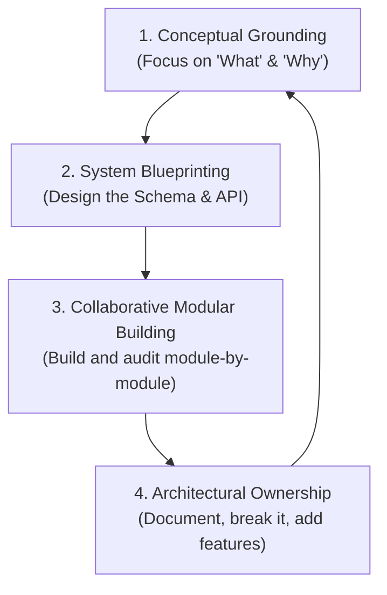

# 🚀 The AI-Era Software Engineer: Career Strategy & Learning Roadmap

Welcome! This roadmap is designed to guide you through the modern software engineering landscape of **Advanced Agentic Coding (AAK)**. It compiles our discussions on how the industry has transformed, what your role is, how recruiters will evaluate you, and how to master new technologies using a repeatable, conceptual framework.

---

## 🧠 Part 1: The Transformation of Software Engineering

In this new era, **typing code characters is being automated**. The act of writing syntax, boilerplate, and wrestling with basic library configurations is handled rapidly by AI agents. 

Your role has shifted from a **"Coder"** to an **"Architect, Systems Director, and Quality Controller"**.

### The Old Paradigm vs. The New Paradigm

| Attribute | The Old Paradigm (Pre-AI) | The New Paradigm (AI-Era) |
| :--- | :--- | :--- |
| **Primary Skill** | Memorizing syntax, typing speed, writing raw boilerplate code. | Systems architecture, conceptual depth, debugging, and auditing. |
| **Engineering Value**| Knowing *how* to write a specific line of code. | Knowing *why* a technology choice is made and *how* systems connect. |
| **Speed & Volume** | Writing simple features took days or weeks. | Full, complex systems can be built and iterated in hours. |
| **Debugging Role** | Hunting down minor typos and syntax formatting. | Acting as a **Lead Code Reviewer** to audit system logic and edge cases. |

---

## 🔍 Part 2: How Recruiters Evaluate You Today

Recruiters in the AI era are looking for **Systems Thinkers** who can design robust, high-performance applications and drive AI tools to build them safely. They evaluate you on four core dimensions:

### 1. Conceptual Depth & Technical "Why"
Recruiters will test the design decisions behind your projects. They will ask questions like:
*   *Why did you use Parent-Child chunking instead of flat chunking?*
*   *Why did you select an offline Cross-Encoder reranking model?*
*   *Why did you choose HyDE?*
*   **The Expectation:** You must be able to justify engineering trade-offs logically. For example, explaining that Parent-Child chunking allows high-precision vector search on small child chunks while delivering a rich context window to the LLM.

### 2. Tracing the Data Lifecycle
You must be able to explain exactly how data travels through your system.
*   **The Expectation:** If asked, you should be able to sketch or explain the sequence of operations for key flows. For example, tracing an uploaded PDF in your RAG application:
    1.  Receives file and hashes content (`api.py`).
    2.  Extracts raw text and formats tables (`pdf_loader.py`).
    3.  Splits text and prepends context prefixes (`text_chunker.py`).
    4.  Encodes searchable text to dense vectors (`embedding_generator.py`).
    5.  Saves vectors to a flat index and pickles metadata (`vector_store.py`).

### 3. Auditing & Peer-Review Capabilities
AI writes code fast, but it makes subtle mistakes or leaves out essential functions (like the missing `_format_table_row` in the initial `pdf_loader.py` script).
*   **The Expectation:** Show that you can act as a **Lead Auditor**. Be prepared to tell stories of how you audited AI-generated code, found gaps or bugs, implemented robust fixes, and verified execution.

---

## 🔄 Part 3: The "Architect-Builder" Learning Loop

To learn concepts and build projects simultaneously without getting bogged down by syntax, follow this repeatable **4-Step Loop** for every future project:

### 📍 Step 1: Conceptual Grounding (10% - 20% of Time)
Learn the conceptual landscape before you write a single line of code.
*   **Action:** Spend 1–2 days researching the core tech. Watch YouTube system architectural overviews, read technical blogs, and query your AI.
*   **Prompt to AI:** 
    > *"I want to build a [Project Name]. What are the standard industry architectures, the core data structures, and the major technical challenges/trade-offs involved in this type of system? Explain it conceptually without writing code."*

### 📍 Step 2: System Blueprinting (20% of Time)
Create a technical design document. Never start coding with an empty folder.
*   **Action:**
    *   Define user stories and functional requirements.
    *   Design the directory layout.
    *   Define database schemas and data models.
    *   Define API endpoints (e.g., `POST /chat`, `GET /history`).
    *   Draw a flowchart showing how data circulates through the app.

### 📍 Step 3: Collaborative Modular Building (40% of Time)
Build in small, isolated blocks. Never ask AI to write the whole project at once.
*   **Action:**
    *   Build module-by-module (Database first, then API logic, then Frontend).
    *   **Audit everything:** If the AI writes a function or imports a package you don't know, stop and ask: *"Why did you use this specific package? Explain this line."*
    *   **Learn from bugs:** When an error occurs, ask the AI: *"Why did this error happen? How does your proposed fix resolve it?"*

### 📍 Step 4: Architectural Ownership & Iteration (20% - 30% of Time)
Take full mental ownership of the project.
*   **Action:**
    *   **Write a Walkthrough:** Document the system in your own words (like our `backend_architecture_walkthrough.md`). Teaching is the best way to verify your own understanding.
    *   **Break the Code on Purpose:** Disable variables, delete handler blocks, and observe how the application handles failure.
    *   **Add a Custom Feature:** Independently design and pair-program one extra complex feature into the finished app.

---

## 🚀 Part 4: Future Recruitable Project Ideas

Here are three high-value projects you can build next using this exact framework:

| Project | Core Concepts to Learn | Why Recruiters Love It |
| :--- | :--- | :--- |
| **1. Real-Time Collaborative Whiteboard** | WebSockets, Canvas API, Operational Transformation (OT), state synchronization. | Proves you can manage complex, real-time networking and concurrent frontend states. |
| **2. AI Financial Advisor Agent** | Tool calling (Function calling), LangChain/LlamaIndex agents, API integrations, data streaming. | Proves you can build actual "autonomous AI agents," which is the cutting edge of tech right now. |
| **3. High-Throughput E-Commerce API** | PostgreSQL indexing, Redis caching, task queues (Celery), load testing. | Proves you understand backend system performance, database scaling, and task queues. |

---

> *"The AI is your super-powered co-pilot, but you are the pilot steering the plane. Master the concepts, design the system, review the code, and you will stand out as an elite software engineer."*

*Guide created by Antigravity AI pair programmer.*
