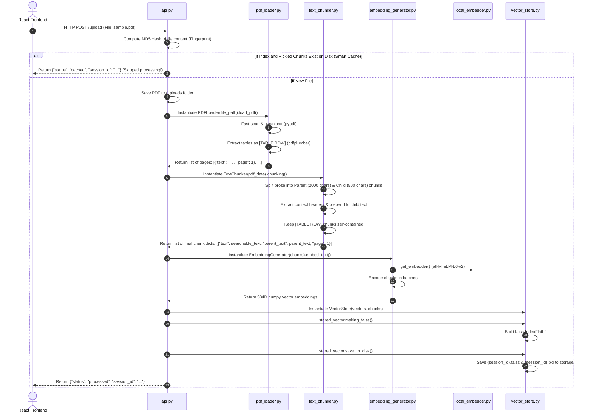
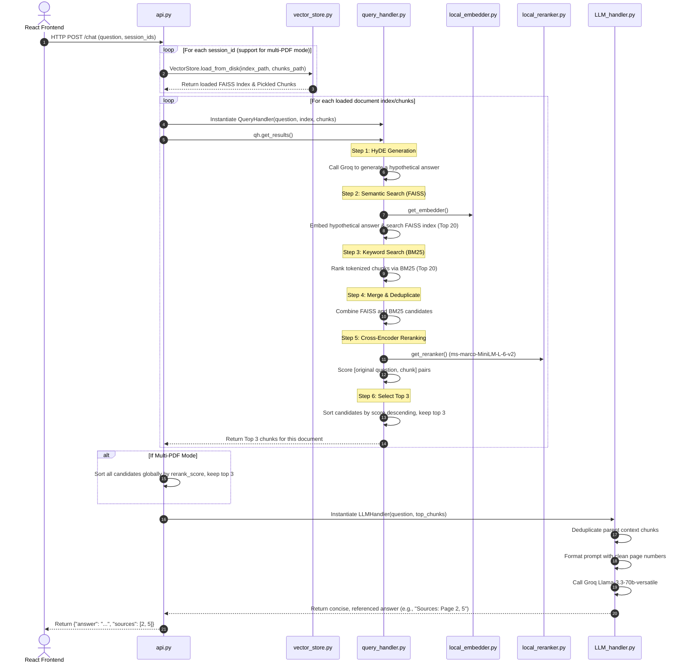

# 🧠 PDF Brain Backend Architecture Walkthrough (A to Z)

Welcome to the technical guide of the **PDF Brain** RAG (Retrieval-Augmented Generation) backend. This document provides an in-depth breakdown of every script in the `backend/` folder and visualizes the exact sequence of executions for document ingestion and QA retrieval.

---

## 📂 Backend File Catalog & Responsibilities

Here is an A-to-Z breakdown of every Python module in the [backend](file:///d:/Coding%20Stuff/Freelancing/RAG_App/backend) folder:

### 1. [api.py](file:///d:/Coding%20Stuff/Freelancing/RAG_App/backend/api.py) — The Orchestrator
- **Role:** Exposes REST endpoints via **FastAPI** and orchestrates the workflows between all other files.
- **Key Functions:**
  - `upload_pdf()`: Receives a PDF file, computes an MD5 checksum fingerprint as a unique `session_id`, executes **Smart Cache Check** (if the FAISS index and chunk files already exist on disk, it returns immediately without reprocessing), saves the raw PDF, and triggers the ingestion pipeline.
  - `chat()`: Manages single or multi-PDF query requests. It loads vectors/chunks from disk, triggers the `QueryHandler` search, merges candidates, reranks, and feeds them into the `LLMHandler` for the final answer.
- **Dependencies:** Exposes all scripts.

### 2. [pdf_loader.py](file:///d:/Coding%20Stuff/Freelancing/RAG_App/backend/pdf_loader.py) — Parser & Cleaner
- **Role:** Implements a hybrid extraction strategy to extract clean prose text and structured tables from PDFs.
- **Key Functions:**
  - `load_pdf()`: Opens the PDF with `pypdf.PdfReader` (fast) and optionally `pdfplumber` (slower, for tables).
  - `_clean_text()`: Fixes scientific notation (e.g., matching mathematical exponents like `10 19` into `10^19`) and cleans character encodings.
  - `_should_check_for_tables()`: Optimizes performance by pre-scanning the page text for keywords like `Table`, `%`, or high density of digits. If found, it invokes `pdfplumber` to extract tables, formatting them into lines prefixed with `[TABLE ROW]`.
- **✅ Table Parsing Bug Resolved:** Line 95 calls `self._format_table_row(headers, row)`, which was previously missing in the original codebase. We successfully implemented this helper method inside the `PDFLoader` class, ensuring seamless table extraction without runtime errors. *(See details in the **Resolved Bug Fixes** section at the bottom.)*

### 3. [text_chunker.py](file:///d:/Coding%20Stuff/Freelancing/RAG_App/backend/text_chunker.py) — Text Segmenter
- **Role:** Implements a highly advanced **Parent-Child Chunking** and **Table Preservation** strategy.
- **Key Functions:**
  - `chunking()`: Splits text using two recursive character text splitters:
    1. **Parent Splitter** (2000 characters): Retains deep contextual information; this is what is ultimately passed to the LLM.
    2. **Child Splitter** (500 characters): Splinters parents into precise, searchable fragments; these are converted to embeddings.
  - `_extract_context_prefix()`: Captures the first sentence/header of a parent chunk and prepends it as a context header (e.g., `[Context: Table 3: Variations on the Transformer...]`) to all of its children. This makes numeric-only child chunks searchable!
  - **Table Preservation:** Directly extracts rows beginning with `[TABLE ROW]` and keeps them intact as their own standalone chunks to avoid fragmentation.

### 4. [local_embedder.py](file:///d:/Coding%20Stuff/Freelancing/RAG_App/backend/local_embedder.py) — Embedding Model Singleton
- **Role:** Loads the offline `SentenceTransformer('all-MiniLM-L6-v2')` model at the module level.
- **Key Functions:**
  - `get_embedder()`: Returns a reference to the loaded singleton model, ensuring it is only loaded into memory once.

### 5. [embedding_generator.py](file:///d:/Coding%20Stuff/Freelancing/RAG_App/backend/embedding_generator.py) — Batch Embedding Producer
- **Role:** Batch-processes child chunks and gets their vector representations.
- **Key Functions:**
  - `embed_text()`: Extracts the `text` attribute (the searchable text with context prefix) of all chunks and encodes them via `local_embedder` into 384-dimensional dense vectors.

### 6. [vector_store.py](file:///d:/Coding%20Stuff/Freelancing/RAG_App/backend/vector_store.py) — Vector Database Manager
- **Role:** Manages the FAISS (Facebook AI Similarity Search) index and saves/loads metadata.
- **Key Functions:**
  - `making_faiss()`: Builds an L2-distance FAISS flat index (`faiss.IndexFlatL2`) from float32 numpy vector representations.
  - `save_to_disk()`: Saves the FAISS index as `.faiss` and pickles (`pickle.dump`) the chunks array containing the text metadata to `.pkl`.
  - `load_from_disk()`: Reads the index and pickle chunks back into memory.

### 7. [local_reranker.py](file:///d:/Coding%20Stuff/Freelancing/RAG_App/backend/local_reranker.py) — Cross-Encoder Singleton
- **Role:** Loads the offline `CrossEncoder('cross-encoder/ms-marco-MiniLM-L-6-v2')` model.
- **Key Functions:**
  - `get_reranker()`: Returns the singleton instance of the Cross-Encoder model.

### 8. [query_handler.py](file:///d:/Coding%20Stuff/Freelancing/RAG_App/backend/query_handler.py) — Hybrid Retrieval Engine
- **Role:** The core search engine, using **HyDE (Hypothetical Document Embeddings)**, **Hybrid Search (FAISS + BM25)**, and **Cross-Encoder Reranking**.
- **Key Functions:**
  - `_generate_hypothetical_answer()`: Generates a short, mock answer to the user's question via Groq's Llama 3.3 model. This is the **HyDE** strategy, improving semantic matching.
  - `_semantic_search()`: Embeds the HyDE answer and performs L2 distance search on FAISS (top 20 candidates).
  - `_bm25_search()`: Uses exact keyword matching via BM25 (`rank_bm25`) to get another top 20 candidates.
  - `get_results()`: Merges and deduplicates candidate indices, then runs them through `local_reranker` against the **original user question** to re-score them. Returns the top 3 absolute most relevant chunks.

### 9. [LLM_handler.py](file:///d:/Coding%20Stuff/Freelancing/RAG_App/backend/LLM_handler.py) — Generator
- **Role:** Formulates the final prompt, interfaces with the Groq Llama 3.3 70B model, and returns the answer.
- **Key Functions:**
  - `make_chatbot()`: Formats the retrieved chunks (deduplicated by `parent_text` to avoid context window clutter) with their source page headers, sets rigorous constraints (1-2 sentences, answer only from context), calls the Groq OpenAI-compatible client, and retrieves the text.

---

## 🔄 Execution Sequence Diagrams

Here is how the Python scripts work in sequence across the two core backend workflows.

### Sequence A: PDF Ingestion & Indexing Pipeline (Upload)

When a user clicks "Upload" in the React frontend, the following sequence is executed:



---

### Sequence B: Q&A Query & Synthesis Pipeline (Chat)

When a user types a message in the chat input, the following sequence is executed:



---

## 🛠️ Resolved Bug Fixes: Implemented `_format_table_row`

As noted in the component analysis, `pdf_loader.py` attempts to format extracted tables on line 95:
```python
formatted = self._format_table_row(headers, row)
```
Previously, this method was not implemented, causing table extraction to fail with an `AttributeError`. We successfully resolved this by implementing this helper method inside [pdf_loader.py](file:///d:/Coding%20Stuff/Freelancing/RAG_App/backend/pdf_loader.py):

```python
    def _format_table_row(self, headers: list, row: list) -> str:
        """Helper to format a single table row into a readable text format."""
        pairs = []
        for h, v in zip(headers, row):
            val = str(v).strip().replace('\n', ' ') if v else ''
            if val:
                pairs.append(f"{h}: {val}" if h else val)
        return " | ".join(pairs)
```

---

*Walkthrough created by Antigravity AI pair programmer.*
